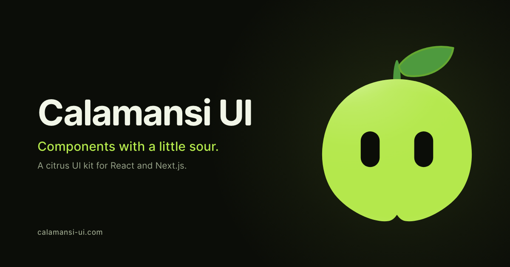

<p align="center">
  
</p>

<h1 align="center">Calamansi UI</h1>

<p align="center">
  <strong>Components with a little sour.</strong><br />
  A tiny, open-source animated React UI component registry for Next.js and Tailwind CSS.
</p>

<p align="center">
  <a href="https://github.com/fujiDevv/calamansi-ui"></a>
  
  
  
  
  
</p>

<p align="center">
  
</p>

---

## Overview

Calamansi UI is an open-source collection of interactive, animated React components built with TypeScript, Tailwind CSS v4, Motion, and GSAP.

Components are published through a custom shadcn registry. Instead of installing heavy node_modules dependencies, you copy the single-file source directly into your codebase using the shadcn CLI, giving you full ownership and customization of the code.

---

## Installation

Install any component directly into your React or Next.js project using the shadcn CLI:

```bash
npx shadcn@latest add https://github.com/fujiDevv/calamansi-ui/<component-name>
```

### Examples

```bash
# Add the interactive mascot
npx shadcn@latest add https://github.com/fujiDevv/calamansi-ui/calamansi

# Add the spotlight card
npx shadcn@latest add https://github.com/fujiDevv/calamansi-ui/spotlight-card

# Add the dock component
npx shadcn@latest add https://github.com/fujiDevv/calamansi-ui/dock
```

---

## Local Development

### Prerequisites
- [Bun](https://bun.sh) (recommended) or Node.js 20+

### Setup

1. Clone the repository:
```bash
git clone https://github.com/fujiDevv/calamansi-ui.git
cd calamansi-ui
```

2. Install dependencies:
```bash
bun install
```

3. Start the development server:
```bash
bun run dev
```
Open [http://localhost:3000](http://localhost:3000) in your browser.

4. Build the registry and static site:
```bash
bun run build
```

5. Preview the production build with Cloudflare Wrangler:
```bash
bun run preview
```

---

## Registry Architecture

Components live in `components/ui/`. Adding a new component involves:

1. Writing the component in `components/ui/<name>.tsx`.
2. Registering the entry in `registry.json`.
3. Adding component metadata (props, usage example, description) to `lib/components.ts`.
4. Adding the documentation route in `app/components/(docs)/<name>/`.
5. Rebuilding registry JSON payloads:
```bash
bun run registry:build
```
Payloads are generated into `public/r/<name>.json`.

---

## Cloudflare Deployment

Calamansi UI is configured to deploy to Cloudflare Workers with Static Assets:

- **Static Pages:** Next.js compiles into static HTML/CSS/JS in the `out/` directory.
- **Edge Functions:** `worker.ts` routes edge requests:
  - `/api/analytics`: Queries Cloudflare D1 serverless SQLite for page views and visitor counts.
  - `/api/mascot-pokes`: Records a poke of the mascot and returns the running total shown in the header.
  - `/api/github-stars`: Fetches and caches GitHub star counts.
  - All other routes: Static assets served directly from edge storage.

### Deploying with Cloudflare Workers Builds

In the Cloudflare Dashboard:
- **Build command:** `bun run build`
- **Deploy command:** `npx wrangler deploy`
- **Version command:** `npx wrangler versions upload`
- **Root directory:** `/`

---

## License

MIT License. Free to use and modify in personal and commercial projects.
Attribution to Calamansi UI is appreciated.
